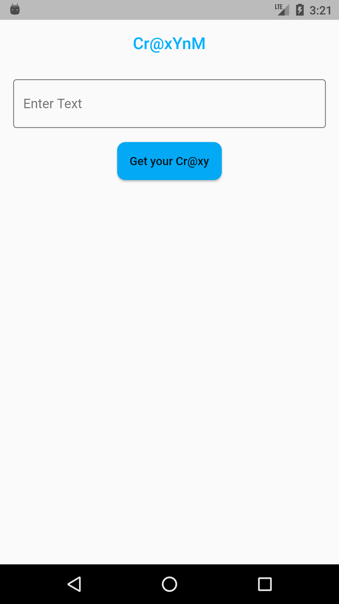
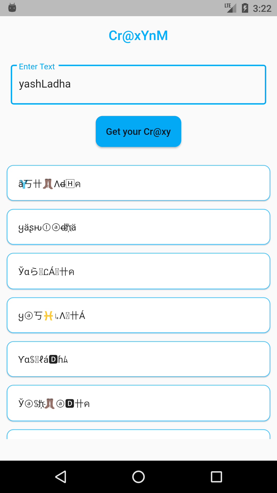
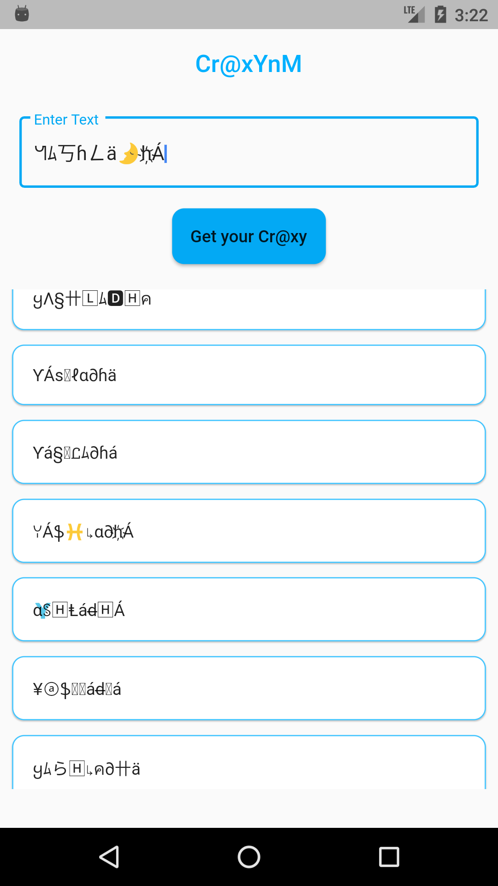

    

    
    

# craxynm

## Getting Started

This project is a starting point for a Flutter application.

A few resources to get you started if this is your first Flutter project:

- [Lab: Write your first Flutter app](https://flutter.io/docs/get-started/codelab)
- [Cookbook: Useful Flutter samples](https://flutter.io/docs/cookbook)

For help getting started with Flutter, view our
[online documentation](https://flutter.io/docs), which offers tutorials,
samples, guidance on mobile development, and a full API reference.

---

## About application

This application is about crazy name generator for those crazy name titles there.
It uses nothing fancy just some random selection from a predefined matrix inside `craxy.dart`. Just tap on the card of your choice and it will be copied to the system clipboard for pasting.

Enjoy the craxyness!!.

## Bugs:
* ~~Re-rendering of child widgets on text input change.~~

## Screenshots

| | |
| ------------------------------------------------------- | --------------------------------------------------------- |
|  
 Intro Message 
 |  
 Display 
 |
|  
 Copied 
 |

## Author
* [yashLadha](https://yashladha.in)